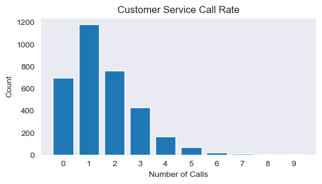
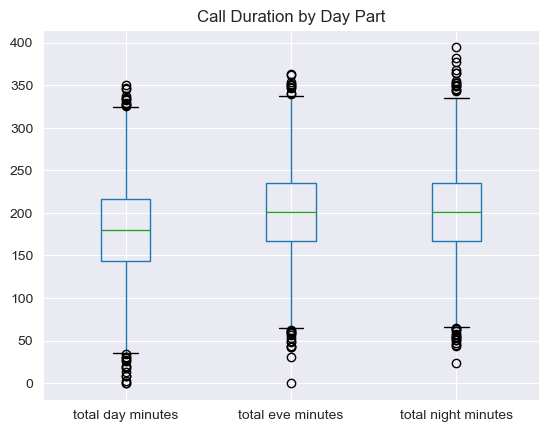
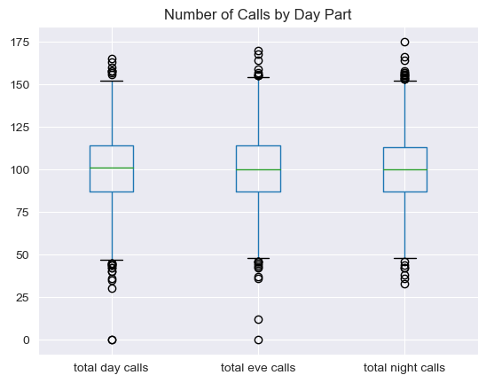
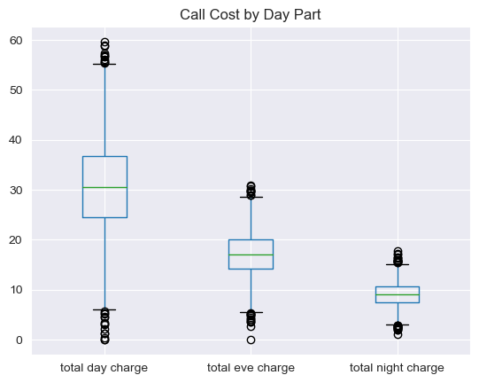
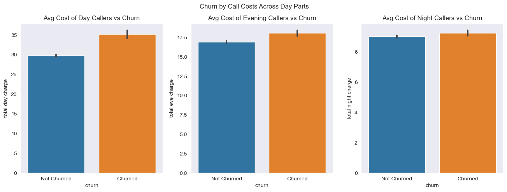
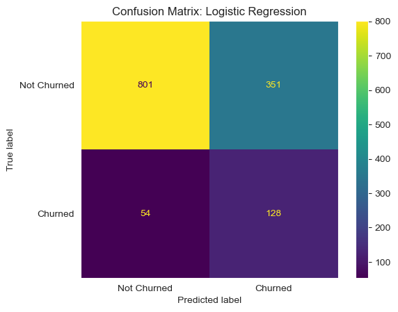
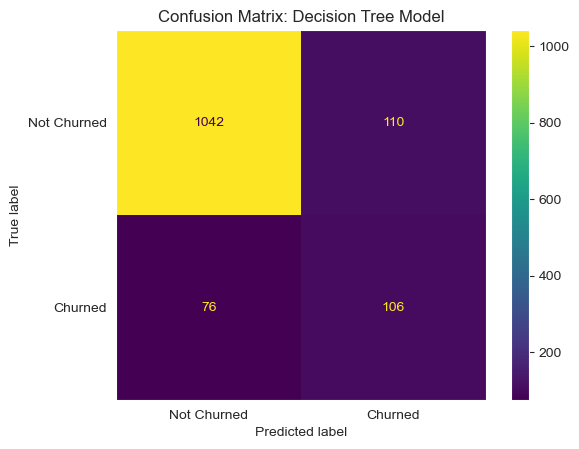
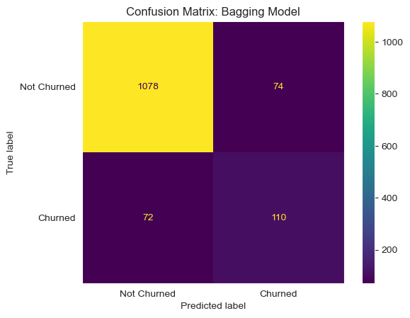
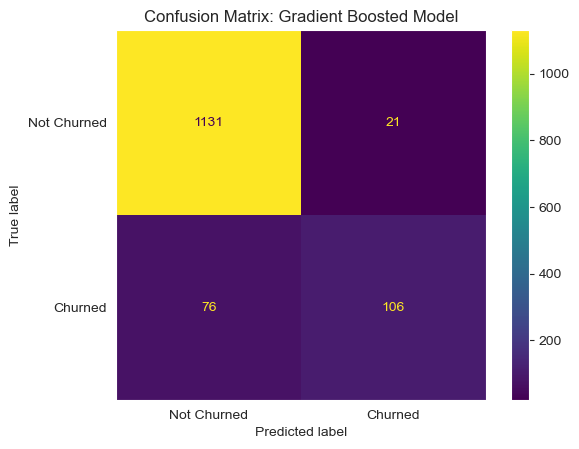

# Phase 3 project

## Business Understanding

### Problem Statement
The marketing team in syriatel would like to understand churn trends help them become more competitive against competition. This will help to improve their customer acquistion and retention strategy

### Objectives
1. Understanding the reasons behind customer churn
2. Build a prediction model to help proof the business against churn
3. Reduce churn to improve business performance

### Data Understanding
Below we will perform a series of steps to prepare the data. We will import the data, preview a few rows, then create a class to help us query the data for some basic information

### Importing Data


```python
# perform necessary imports
import pandas as pd
import numpy as np
import matplotlib.pyplot as plt
import seaborn as sns
%matplotlib inline
sns.set_style('dark')

# load dataset
df = pd.read_csv('.data/churn.csv')

# preview first 5 rows
df.head()
```


<div>
<style scoped>
    .dataframe tbody tr th:only-of-type {
        vertical-align: middle;
    }

    .dataframe tbody tr th {
        vertical-align: top;
    }

    .dataframe thead th {
        text-align: right;
    }
</style>
<table border="1" class="dataframe">
  <thead>
    <tr style="text-align: right;">
      <th></th>
      <th>state</th>
      <th>account length</th>
      <th>area code</th>
      <th>phone number</th>
      <th>international plan</th>
      <th>voice mail plan</th>
      <th>number vmail messages</th>
      <th>total day minutes</th>
      <th>total day calls</th>
      <th>total day charge</th>
      <th>...</th>
      <th>total eve calls</th>
      <th>total eve charge</th>
      <th>total night minutes</th>
      <th>total night calls</th>
      <th>total night charge</th>
      <th>total intl minutes</th>
      <th>total intl calls</th>
      <th>total intl charge</th>
      <th>customer service calls</th>
      <th>churn</th>
    </tr>
  </thead>
  <tbody>
    <tr>
      <th>0</th>
      <td>KS</td>
      <td>128</td>
      <td>415</td>
      <td>382-4657</td>
      <td>no</td>
      <td>yes</td>
      <td>25</td>
      <td>265.1</td>
      <td>110</td>
      <td>45.07</td>
      <td>...</td>
      <td>99</td>
      <td>16.78</td>
      <td>244.7</td>
      <td>91</td>
      <td>11.01</td>
      <td>10.0</td>
      <td>3</td>
      <td>2.70</td>
      <td>1</td>
      <td>False</td>
    </tr>
    <tr>
      <th>1</th>
      <td>OH</td>
      <td>107</td>
      <td>415</td>
      <td>371-7191</td>
      <td>no</td>
      <td>yes</td>
      <td>26</td>
      <td>161.6</td>
      <td>123</td>
      <td>27.47</td>
      <td>...</td>
      <td>103</td>
      <td>16.62</td>
      <td>254.4</td>
      <td>103</td>
      <td>11.45</td>
      <td>13.7</td>
      <td>3</td>
      <td>3.70</td>
      <td>1</td>
      <td>False</td>
    </tr>
    <tr>
      <th>2</th>
      <td>NJ</td>
      <td>137</td>
      <td>415</td>
      <td>358-1921</td>
      <td>no</td>
      <td>no</td>
      <td>0</td>
      <td>243.4</td>
      <td>114</td>
      <td>41.38</td>
      <td>...</td>
      <td>110</td>
      <td>10.30</td>
      <td>162.6</td>
      <td>104</td>
      <td>7.32</td>
      <td>12.2</td>
      <td>5</td>
      <td>3.29</td>
      <td>0</td>
      <td>False</td>
    </tr>
    <tr>
      <th>3</th>
      <td>OH</td>
      <td>84</td>
      <td>408</td>
      <td>375-9999</td>
      <td>yes</td>
      <td>no</td>
      <td>0</td>
      <td>299.4</td>
      <td>71</td>
      <td>50.90</td>
      <td>...</td>
      <td>88</td>
      <td>5.26</td>
      <td>196.9</td>
      <td>89</td>
      <td>8.86</td>
      <td>6.6</td>
      <td>7</td>
      <td>1.78</td>
      <td>2</td>
      <td>False</td>
    </tr>
    <tr>
      <th>4</th>
      <td>OK</td>
      <td>75</td>
      <td>415</td>
      <td>330-6626</td>
      <td>yes</td>
      <td>no</td>
      <td>0</td>
      <td>166.7</td>
      <td>113</td>
      <td>28.34</td>
      <td>...</td>
      <td>122</td>
      <td>12.61</td>
      <td>186.9</td>
      <td>121</td>
      <td>8.41</td>
      <td>10.1</td>
      <td>3</td>
      <td>2.73</td>
      <td>3</td>
      <td>False</td>
    </tr>
  </tbody>
</table>
<p>5 rows × 21 columns</p>
</div>


The code below builds a class `quer_d` that will help us query the data


```python
# build the class

class quer_d:
    
    """ Query dataframe for specific information"""
    
    def __init__(self, data):
        self.data = data
        
    def dshape(self, data):
        """Simple method to provide the shape of the data"""
        
        return print(f"The DataFrame has:\n\t* {data.shape[0]} rows\n\t* {data.shape[1]} columns", '\n')
    
    def dinfo(self, data):
        """Simple method to provide the info of the data"""
        return print(data.info(), '\n')
    
    def dmissing(self, data):
        """ Identify missing values"""
        # identify if data has missing values(data.isnull().any())
        # empty dict to store missing values
        missing = []
        for i in data.isnull().any():
            # add the bool values to empty list 
            missing.append(i)
        # covert list to set (if data has missing value, the list should have true and false)
        missing_set = set(missing)
        if (len(missing_set) == 1):
            out = print("The Data has no missing values", '\n')
        else:
            out = print(f"The Data has missing values.", '\n')

        return out
    
    def d_duplic(self, data):
        """method to identify any duplicates"""
        # identify the duplicates (dataframename.duplicated() , can add .sum() to get total count)
        # empty list to store Bool results from duplicated
        duplicates = []
        for i in data.duplicated():
            duplicates.append(i)
        # identify if there is any duplicates. (If there is any we expect a True value in the list duplicates)
        duplicates_set = set(duplicates) 
        if (len(duplicates_set) == 1):
            out = print("The Data has no duplicates", '\n')
        else:
            no_true = 0
            for val in duplicates:
                if (val == True):
                    no_true += 1
            # percentage of the data represented by duplicates 
            duplicates_percentage = np.round(((no_true / len(data)) * 100), 3)
            out = print(f"The Data has {no_true} duplicated rows.\nThis constitutes {duplicates_percentage}% of the data set.", '\n')
        
        return out
    
    def col_dup(self, data, column):
        """handling duplicates in unique column"""
        # empty list to store the duplicate bools
        duplicates = []
        for i in data[column].duplicated():
            duplicates.append(i)
    
        # identify if there are any duplicates
        duplicates_set = set(duplicates)
        if (len(duplicates_set) == 1):
            out = print(f"The column {column.title()} has no duplicates", '\n')
        else:
            no_true = 0
            for val in duplicates:
                if (val == True):
                    no_true += 1
            # percentage of the data represented by duplicates 
            duplicates_percentage = np.round(((no_true / len(data)) * 100), 3)
            out = print(f"The column {column.title()} has {no_true} duplicated rows.\nThis constitutes {duplicates_percentage}% of the data", '\n')
        
        return out
    
    def d_describe(self, data):
        
        """method to check the descriptive values of the data"""
        return print(data.describe(), '\n')
```

## Data Cleaning
Below we create a class that will:
- convert phone numbers encoded as string to integers
- convert target column encoded as boolean to integer


```python
# create class
class trans:
    """ converting columns to appropriate data type"""
    
    def __init__(self, data):
        self.data = data
        
    def conv(self, data, col):
        """ convert phone number to integer"""
        data[col] = data[col].str.replace('-', '').astype('int')
        return data
    
    def lab(self, data, col):
        """convert churn col to integer"""
        data[col] = data[col].astype('int')
    
        return data

# instantiate class
chg = trans(df)      

```

### Convert Phone Number to Integer
Phone number was saved as a string. The code below will convert it to an integ


```python
# apply instantiated class on dataframe
chg.conv(df, 'phone number')
```


<div>
<style scoped>
    .dataframe tbody tr th:only-of-type {
        vertical-align: middle;
    }

    .dataframe tbody tr th {
        vertical-align: top;
    }

    .dataframe thead th {
        text-align: right;
    }
</style>
<table border="1" class="dataframe">
  <thead>
    <tr style="text-align: right;">
      <th></th>
      <th>state</th>
      <th>account length</th>
      <th>area code</th>
      <th>phone number</th>
      <th>international plan</th>
      <th>voice mail plan</th>
      <th>number vmail messages</th>
      <th>total day minutes</th>
      <th>total day calls</th>
      <th>total day charge</th>
      <th>...</th>
      <th>total eve calls</th>
      <th>total eve charge</th>
      <th>total night minutes</th>
      <th>total night calls</th>
      <th>total night charge</th>
      <th>total intl minutes</th>
      <th>total intl calls</th>
      <th>total intl charge</th>
      <th>customer service calls</th>
      <th>churn</th>
    </tr>
  </thead>
  <tbody>
    <tr>
      <th>0</th>
      <td>KS</td>
      <td>128</td>
      <td>415</td>
      <td>3824657</td>
      <td>no</td>
      <td>yes</td>
      <td>25</td>
      <td>265.1</td>
      <td>110</td>
      <td>45.07</td>
      <td>...</td>
      <td>99</td>
      <td>16.78</td>
      <td>244.7</td>
      <td>91</td>
      <td>11.01</td>
      <td>10.0</td>
      <td>3</td>
      <td>2.70</td>
      <td>1</td>
      <td>False</td>
    </tr>
    <tr>
      <th>1</th>
      <td>OH</td>
      <td>107</td>
      <td>415</td>
      <td>3717191</td>
      <td>no</td>
      <td>yes</td>
      <td>26</td>
      <td>161.6</td>
      <td>123</td>
      <td>27.47</td>
      <td>...</td>
      <td>103</td>
      <td>16.62</td>
      <td>254.4</td>
      <td>103</td>
      <td>11.45</td>
      <td>13.7</td>
      <td>3</td>
      <td>3.70</td>
      <td>1</td>
      <td>False</td>
    </tr>
    <tr>
      <th>2</th>
      <td>NJ</td>
      <td>137</td>
      <td>415</td>
      <td>3581921</td>
      <td>no</td>
      <td>no</td>
      <td>0</td>
      <td>243.4</td>
      <td>114</td>
      <td>41.38</td>
      <td>...</td>
      <td>110</td>
      <td>10.30</td>
      <td>162.6</td>
      <td>104</td>
      <td>7.32</td>
      <td>12.2</td>
      <td>5</td>
      <td>3.29</td>
      <td>0</td>
      <td>False</td>
    </tr>
    <tr>
      <th>3</th>
      <td>OH</td>
      <td>84</td>
      <td>408</td>
      <td>3759999</td>
      <td>yes</td>
      <td>no</td>
      <td>0</td>
      <td>299.4</td>
      <td>71</td>
      <td>50.90</td>
      <td>...</td>
      <td>88</td>
      <td>5.26</td>
      <td>196.9</td>
      <td>89</td>
      <td>8.86</td>
      <td>6.6</td>
      <td>7</td>
      <td>1.78</td>
      <td>2</td>
      <td>False</td>
    </tr>
    <tr>
      <th>4</th>
      <td>OK</td>
      <td>75</td>
      <td>415</td>
      <td>3306626</td>
      <td>yes</td>
      <td>no</td>
      <td>0</td>
      <td>166.7</td>
      <td>113</td>
      <td>28.34</td>
      <td>...</td>
      <td>122</td>
      <td>12.61</td>
      <td>186.9</td>
      <td>121</td>
      <td>8.41</td>
      <td>10.1</td>
      <td>3</td>
      <td>2.73</td>
      <td>3</td>
      <td>False</td>
    </tr>
    <tr>
      <th>...</th>
      <td>...</td>
      <td>...</td>
      <td>...</td>
      <td>...</td>
      <td>...</td>
      <td>...</td>
      <td>...</td>
      <td>...</td>
      <td>...</td>
      <td>...</td>
      <td>...</td>
      <td>...</td>
      <td>...</td>
      <td>...</td>
      <td>...</td>
      <td>...</td>
      <td>...</td>
      <td>...</td>
      <td>...</td>
      <td>...</td>
      <td>...</td>
    </tr>
    <tr>
      <th>3328</th>
      <td>AZ</td>
      <td>192</td>
      <td>415</td>
      <td>4144276</td>
      <td>no</td>
      <td>yes</td>
      <td>36</td>
      <td>156.2</td>
      <td>77</td>
      <td>26.55</td>
      <td>...</td>
      <td>126</td>
      <td>18.32</td>
      <td>279.1</td>
      <td>83</td>
      <td>12.56</td>
      <td>9.9</td>
      <td>6</td>
      <td>2.67</td>
      <td>2</td>
      <td>False</td>
    </tr>
    <tr>
      <th>3329</th>
      <td>WV</td>
      <td>68</td>
      <td>415</td>
      <td>3703271</td>
      <td>no</td>
      <td>no</td>
      <td>0</td>
      <td>231.1</td>
      <td>57</td>
      <td>39.29</td>
      <td>...</td>
      <td>55</td>
      <td>13.04</td>
      <td>191.3</td>
      <td>123</td>
      <td>8.61</td>
      <td>9.6</td>
      <td>4</td>
      <td>2.59</td>
      <td>3</td>
      <td>False</td>
    </tr>
    <tr>
      <th>3330</th>
      <td>RI</td>
      <td>28</td>
      <td>510</td>
      <td>3288230</td>
      <td>no</td>
      <td>no</td>
      <td>0</td>
      <td>180.8</td>
      <td>109</td>
      <td>30.74</td>
      <td>...</td>
      <td>58</td>
      <td>24.55</td>
      <td>191.9</td>
      <td>91</td>
      <td>8.64</td>
      <td>14.1</td>
      <td>6</td>
      <td>3.81</td>
      <td>2</td>
      <td>False</td>
    </tr>
    <tr>
      <th>3331</th>
      <td>CT</td>
      <td>184</td>
      <td>510</td>
      <td>3646381</td>
      <td>yes</td>
      <td>no</td>
      <td>0</td>
      <td>213.8</td>
      <td>105</td>
      <td>36.35</td>
      <td>...</td>
      <td>84</td>
      <td>13.57</td>
      <td>139.2</td>
      <td>137</td>
      <td>6.26</td>
      <td>5.0</td>
      <td>10</td>
      <td>1.35</td>
      <td>2</td>
      <td>False</td>
    </tr>
    <tr>
      <th>3332</th>
      <td>TN</td>
      <td>74</td>
      <td>415</td>
      <td>4004344</td>
      <td>no</td>
      <td>yes</td>
      <td>25</td>
      <td>234.4</td>
      <td>113</td>
      <td>39.85</td>
      <td>...</td>
      <td>82</td>
      <td>22.60</td>
      <td>241.4</td>
      <td>77</td>
      <td>10.86</td>
      <td>13.7</td>
      <td>4</td>
      <td>3.70</td>
      <td>0</td>
      <td>False</td>
    </tr>
  </tbody>
</table>
<p>3333 rows × 21 columns</p>
</div>


### Convert Churn Column to Integer
The `churn` col is currently encoded as boolean. The function below converts it to a binary variable


```python
# apply instantiated class on dataframe
    
chg.lab(df, 'churn')
```


<div>
<style scoped>
    .dataframe tbody tr th:only-of-type {
        vertical-align: middle;
    }

    .dataframe tbody tr th {
        vertical-align: top;
    }

    .dataframe thead th {
        text-align: right;
    }
</style>
<table border="1" class="dataframe">
  <thead>
    <tr style="text-align: right;">
      <th></th>
      <th>state</th>
      <th>account length</th>
      <th>area code</th>
      <th>phone number</th>
      <th>international plan</th>
      <th>voice mail plan</th>
      <th>number vmail messages</th>
      <th>total day minutes</th>
      <th>total day calls</th>
      <th>total day charge</th>
      <th>...</th>
      <th>total eve calls</th>
      <th>total eve charge</th>
      <th>total night minutes</th>
      <th>total night calls</th>
      <th>total night charge</th>
      <th>total intl minutes</th>
      <th>total intl calls</th>
      <th>total intl charge</th>
      <th>customer service calls</th>
      <th>churn</th>
    </tr>
  </thead>
  <tbody>
    <tr>
      <th>0</th>
      <td>KS</td>
      <td>128</td>
      <td>415</td>
      <td>3824657</td>
      <td>no</td>
      <td>yes</td>
      <td>25</td>
      <td>265.1</td>
      <td>110</td>
      <td>45.07</td>
      <td>...</td>
      <td>99</td>
      <td>16.78</td>
      <td>244.7</td>
      <td>91</td>
      <td>11.01</td>
      <td>10.0</td>
      <td>3</td>
      <td>2.70</td>
      <td>1</td>
      <td>0</td>
    </tr>
    <tr>
      <th>1</th>
      <td>OH</td>
      <td>107</td>
      <td>415</td>
      <td>3717191</td>
      <td>no</td>
      <td>yes</td>
      <td>26</td>
      <td>161.6</td>
      <td>123</td>
      <td>27.47</td>
      <td>...</td>
      <td>103</td>
      <td>16.62</td>
      <td>254.4</td>
      <td>103</td>
      <td>11.45</td>
      <td>13.7</td>
      <td>3</td>
      <td>3.70</td>
      <td>1</td>
      <td>0</td>
    </tr>
    <tr>
      <th>2</th>
      <td>NJ</td>
      <td>137</td>
      <td>415</td>
      <td>3581921</td>
      <td>no</td>
      <td>no</td>
      <td>0</td>
      <td>243.4</td>
      <td>114</td>
      <td>41.38</td>
      <td>...</td>
      <td>110</td>
      <td>10.30</td>
      <td>162.6</td>
      <td>104</td>
      <td>7.32</td>
      <td>12.2</td>
      <td>5</td>
      <td>3.29</td>
      <td>0</td>
      <td>0</td>
    </tr>
    <tr>
      <th>3</th>
      <td>OH</td>
      <td>84</td>
      <td>408</td>
      <td>3759999</td>
      <td>yes</td>
      <td>no</td>
      <td>0</td>
      <td>299.4</td>
      <td>71</td>
      <td>50.90</td>
      <td>...</td>
      <td>88</td>
      <td>5.26</td>
      <td>196.9</td>
      <td>89</td>
      <td>8.86</td>
      <td>6.6</td>
      <td>7</td>
      <td>1.78</td>
      <td>2</td>
      <td>0</td>
    </tr>
    <tr>
      <th>4</th>
      <td>OK</td>
      <td>75</td>
      <td>415</td>
      <td>3306626</td>
      <td>yes</td>
      <td>no</td>
      <td>0</td>
      <td>166.7</td>
      <td>113</td>
      <td>28.34</td>
      <td>...</td>
      <td>122</td>
      <td>12.61</td>
      <td>186.9</td>
      <td>121</td>
      <td>8.41</td>
      <td>10.1</td>
      <td>3</td>
      <td>2.73</td>
      <td>3</td>
      <td>0</td>
    </tr>
    <tr>
      <th>...</th>
      <td>...</td>
      <td>...</td>
      <td>...</td>
      <td>...</td>
      <td>...</td>
      <td>...</td>
      <td>...</td>
      <td>...</td>
      <td>...</td>
      <td>...</td>
      <td>...</td>
      <td>...</td>
      <td>...</td>
      <td>...</td>
      <td>...</td>
      <td>...</td>
      <td>...</td>
      <td>...</td>
      <td>...</td>
      <td>...</td>
      <td>...</td>
    </tr>
    <tr>
      <th>3328</th>
      <td>AZ</td>
      <td>192</td>
      <td>415</td>
      <td>4144276</td>
      <td>no</td>
      <td>yes</td>
      <td>36</td>
      <td>156.2</td>
      <td>77</td>
      <td>26.55</td>
      <td>...</td>
      <td>126</td>
      <td>18.32</td>
      <td>279.1</td>
      <td>83</td>
      <td>12.56</td>
      <td>9.9</td>
      <td>6</td>
      <td>2.67</td>
      <td>2</td>
      <td>0</td>
    </tr>
    <tr>
      <th>3329</th>
      <td>WV</td>
      <td>68</td>
      <td>415</td>
      <td>3703271</td>
      <td>no</td>
      <td>no</td>
      <td>0</td>
      <td>231.1</td>
      <td>57</td>
      <td>39.29</td>
      <td>...</td>
      <td>55</td>
      <td>13.04</td>
      <td>191.3</td>
      <td>123</td>
      <td>8.61</td>
      <td>9.6</td>
      <td>4</td>
      <td>2.59</td>
      <td>3</td>
      <td>0</td>
    </tr>
    <tr>
      <th>3330</th>
      <td>RI</td>
      <td>28</td>
      <td>510</td>
      <td>3288230</td>
      <td>no</td>
      <td>no</td>
      <td>0</td>
      <td>180.8</td>
      <td>109</td>
      <td>30.74</td>
      <td>...</td>
      <td>58</td>
      <td>24.55</td>
      <td>191.9</td>
      <td>91</td>
      <td>8.64</td>
      <td>14.1</td>
      <td>6</td>
      <td>3.81</td>
      <td>2</td>
      <td>0</td>
    </tr>
    <tr>
      <th>3331</th>
      <td>CT</td>
      <td>184</td>
      <td>510</td>
      <td>3646381</td>
      <td>yes</td>
      <td>no</td>
      <td>0</td>
      <td>213.8</td>
      <td>105</td>
      <td>36.35</td>
      <td>...</td>
      <td>84</td>
      <td>13.57</td>
      <td>139.2</td>
      <td>137</td>
      <td>6.26</td>
      <td>5.0</td>
      <td>10</td>
      <td>1.35</td>
      <td>2</td>
      <td>0</td>
    </tr>
    <tr>
      <th>3332</th>
      <td>TN</td>
      <td>74</td>
      <td>415</td>
      <td>4004344</td>
      <td>no</td>
      <td>yes</td>
      <td>25</td>
      <td>234.4</td>
      <td>113</td>
      <td>39.85</td>
      <td>...</td>
      <td>82</td>
      <td>22.60</td>
      <td>241.4</td>
      <td>77</td>
      <td>10.86</td>
      <td>13.7</td>
      <td>4</td>
      <td>3.70</td>
      <td>0</td>
      <td>0</td>
    </tr>
  </tbody>
</table>
<p>3333 rows × 21 columns</p>
</div>


## Exploratory Data Analysis

### Mismatch: Voicemail and International 
The code below shows that columns `voice mail plan` and `international plan` categories don't match with actual data. Below we analyse day minutes and see that non subscribers have values. We will drop both columns as I believe the actual transactional data will be able to relay the required patterns for the different subscribers

We will also drop the `state` column because the data contains 56 unique states, thus one hot encoding this will be cumbersome. Since the `area code` column also contains geographic information, we'll use this for our model

`phone number` will be dropped as well, since it is just a variable used for distingusishing between customers


```python
print(df.groupby('voice mail plan')['total day minutes'].mean(), '\n')
print(df.groupby('international plan')['total intl minutes'].mean())
```

    voice mail plan
    no     179.831813
    yes    179.626790
    Name: total day minutes, dtype: float64 
    
    international plan
    no     10.195349
    yes    10.628173
    Name: total intl minutes, dtype: float64
    


```python
# function to drop columns

def drp(data, col):
    """drop specified column"""
    data.drop(col, axis=1, inplace=True)
    
    return data

# apply to dataframe

drp(df, ['voice mail plan', 'international plan', 'state', 'phone number'])
```


<div>
<style scoped>
    .dataframe tbody tr th:only-of-type {
        vertical-align: middle;
    }

    .dataframe tbody tr th {
        vertical-align: top;
    }

    .dataframe thead th {
        text-align: right;
    }
</style>
<table border="1" class="dataframe">
  <thead>
    <tr style="text-align: right;">
      <th></th>
      <th>account length</th>
      <th>area code</th>
      <th>number vmail messages</th>
      <th>total day minutes</th>
      <th>total day calls</th>
      <th>total day charge</th>
      <th>total eve minutes</th>
      <th>total eve calls</th>
      <th>total eve charge</th>
      <th>total night minutes</th>
      <th>total night calls</th>
      <th>total night charge</th>
      <th>total intl minutes</th>
      <th>total intl calls</th>
      <th>total intl charge</th>
      <th>customer service calls</th>
      <th>churn</th>
    </tr>
  </thead>
  <tbody>
    <tr>
      <th>0</th>
      <td>128</td>
      <td>415</td>
      <td>25</td>
      <td>265.1</td>
      <td>110</td>
      <td>45.07</td>
      <td>197.4</td>
      <td>99</td>
      <td>16.78</td>
      <td>244.7</td>
      <td>91</td>
      <td>11.01</td>
      <td>10.0</td>
      <td>3</td>
      <td>2.70</td>
      <td>1</td>
      <td>0</td>
    </tr>
    <tr>
      <th>1</th>
      <td>107</td>
      <td>415</td>
      <td>26</td>
      <td>161.6</td>
      <td>123</td>
      <td>27.47</td>
      <td>195.5</td>
      <td>103</td>
      <td>16.62</td>
      <td>254.4</td>
      <td>103</td>
      <td>11.45</td>
      <td>13.7</td>
      <td>3</td>
      <td>3.70</td>
      <td>1</td>
      <td>0</td>
    </tr>
    <tr>
      <th>2</th>
      <td>137</td>
      <td>415</td>
      <td>0</td>
      <td>243.4</td>
      <td>114</td>
      <td>41.38</td>
      <td>121.2</td>
      <td>110</td>
      <td>10.30</td>
      <td>162.6</td>
      <td>104</td>
      <td>7.32</td>
      <td>12.2</td>
      <td>5</td>
      <td>3.29</td>
      <td>0</td>
      <td>0</td>
    </tr>
    <tr>
      <th>3</th>
      <td>84</td>
      <td>408</td>
      <td>0</td>
      <td>299.4</td>
      <td>71</td>
      <td>50.90</td>
      <td>61.9</td>
      <td>88</td>
      <td>5.26</td>
      <td>196.9</td>
      <td>89</td>
      <td>8.86</td>
      <td>6.6</td>
      <td>7</td>
      <td>1.78</td>
      <td>2</td>
      <td>0</td>
    </tr>
    <tr>
      <th>4</th>
      <td>75</td>
      <td>415</td>
      <td>0</td>
      <td>166.7</td>
      <td>113</td>
      <td>28.34</td>
      <td>148.3</td>
      <td>122</td>
      <td>12.61</td>
      <td>186.9</td>
      <td>121</td>
      <td>8.41</td>
      <td>10.1</td>
      <td>3</td>
      <td>2.73</td>
      <td>3</td>
      <td>0</td>
    </tr>
    <tr>
      <th>...</th>
      <td>...</td>
      <td>...</td>
      <td>...</td>
      <td>...</td>
      <td>...</td>
      <td>...</td>
      <td>...</td>
      <td>...</td>
      <td>...</td>
      <td>...</td>
      <td>...</td>
      <td>...</td>
      <td>...</td>
      <td>...</td>
      <td>...</td>
      <td>...</td>
      <td>...</td>
    </tr>
    <tr>
      <th>3328</th>
      <td>192</td>
      <td>415</td>
      <td>36</td>
      <td>156.2</td>
      <td>77</td>
      <td>26.55</td>
      <td>215.5</td>
      <td>126</td>
      <td>18.32</td>
      <td>279.1</td>
      <td>83</td>
      <td>12.56</td>
      <td>9.9</td>
      <td>6</td>
      <td>2.67</td>
      <td>2</td>
      <td>0</td>
    </tr>
    <tr>
      <th>3329</th>
      <td>68</td>
      <td>415</td>
      <td>0</td>
      <td>231.1</td>
      <td>57</td>
      <td>39.29</td>
      <td>153.4</td>
      <td>55</td>
      <td>13.04</td>
      <td>191.3</td>
      <td>123</td>
      <td>8.61</td>
      <td>9.6</td>
      <td>4</td>
      <td>2.59</td>
      <td>3</td>
      <td>0</td>
    </tr>
    <tr>
      <th>3330</th>
      <td>28</td>
      <td>510</td>
      <td>0</td>
      <td>180.8</td>
      <td>109</td>
      <td>30.74</td>
      <td>288.8</td>
      <td>58</td>
      <td>24.55</td>
      <td>191.9</td>
      <td>91</td>
      <td>8.64</td>
      <td>14.1</td>
      <td>6</td>
      <td>3.81</td>
      <td>2</td>
      <td>0</td>
    </tr>
    <tr>
      <th>3331</th>
      <td>184</td>
      <td>510</td>
      <td>0</td>
      <td>213.8</td>
      <td>105</td>
      <td>36.35</td>
      <td>159.6</td>
      <td>84</td>
      <td>13.57</td>
      <td>139.2</td>
      <td>137</td>
      <td>6.26</td>
      <td>5.0</td>
      <td>10</td>
      <td>1.35</td>
      <td>2</td>
      <td>0</td>
    </tr>
    <tr>
      <th>3332</th>
      <td>74</td>
      <td>415</td>
      <td>25</td>
      <td>234.4</td>
      <td>113</td>
      <td>39.85</td>
      <td>265.9</td>
      <td>82</td>
      <td>22.60</td>
      <td>241.4</td>
      <td>77</td>
      <td>10.86</td>
      <td>13.7</td>
      <td>4</td>
      <td>3.70</td>
      <td>0</td>
      <td>0</td>
    </tr>
  </tbody>
</table>
<p>3333 rows × 17 columns</p>
</div>


### Churn rate
The data shows a churn rate of 14%, meaning that our target variable is imbalanced. We will therefore have to correct for the imbalances when modeling


```python
# plot the churn rate
fig, ax = plt.subplots(figsize=(6, 3))

plt.bar(df.churn.value_counts(normalize=True).index, df.churn.value_counts(normalize=True).values)
plt.xticks([0, 1])
plt.title('Churn Rate')
plt.xlabel('Did the customer churn?')
plt.ylabel('Churn Rate');

```


    

    


### Geographic Distribution
Roughly half of the subscribers are located in area code 415. The remainder are evenly distributed between 408 and 510


```python
# regional distribution
fig, ax = plt.subplots(figsize=(6, 3))

plt.bar(['415', '408', '510'], df['area code'].value_counts(normalize=True).values)
plt.title('Area code distribution')
plt.xlabel('Area code')
plt.ylabel('Percentage');
```


    

    


### Customer Service Calls
Calls to customer service is binomially distributed with most people making 1 to 3 calls


```python
# customer service calls
fig, ax = plt.subplots(figsize=(6, 3))

plt.bar(df['customer service calls'].value_counts().index, df['customer service calls'].value_counts().values)
plt.xticks(df['customer service calls'].value_counts().index)
plt.title('Customer Service Call Rate')
plt.xlabel('Number of Calls')
plt.ylabel('Count');
```


    

    


### How Does Call Duration Vary By Day Part?
Call duration increases by day part, thus evening and night calls last longer than day calls


```python
df[['total day minutes', 'total eve minutes', 'total night minutes']].boxplot()
plt.title('Call Duration by Day Part');
```


    

    


### How Do Number of Calls Vary By Day Part?¶
Number of calls made doesn't vary by day part


```python
df[['total day calls', 'total eve calls', 'total night calls']].boxplot()
plt.title('Number of Calls by Day Part');
```


    

    


### How Do Costs of Calls Vary By Day Part?
Costs tend to be cheaper in the evenings and at night, the reason why customers spend more time on the phone at night, than during the day. Also, there's a much bigger variance in call costs during the day


```python
df[['total day charge', 'total eve charge', 'total night charge']].boxplot()
plt.title('Call Cost by Day Part');
```


    

    


### How Expensive is Churn For Syriatel?
Those who churn spend more on average than those who don't, espcially those who call during the day. Syriatel is therefore losing customers who bring in more revenue through churn


```python
fig, axes = plt.subplots(ncols=3, figsize=(16, 5))
fig.suptitle('Churn by Call Costs Across Day Parts')
for i,col in enumerate(df[['total day charge', 'total eve charge', 'total night charge']].columns):
    sns.barplot(x=df['churn'], y=df[col], ax=axes[i])
    axes[i].set_xticks([0, 1], ['Not Churned', 'Churned'])
    
axes[0].set_title('Avg Cost of Day Callers vs Churn')
axes[1].set_title('Avg Cost of Evening Callers vs Churn')
axes[2].set_title('Avg Cost of Night Callers vs Churn');
```


    Text(0.5, 1.0, 'Avg Cost of Night Callers vs Churn')


    

    


## Modelling
Since our target variable is not continuous, we will consider classification models:
- we will split training and  test data
- standardize the data since the columns have data on varying scales
- start with logistic regression as our basline model, then move on to more sophisticated models
- account for imbalanced classes  in the target variable


```python
# imports
from sklearn.model_selection import train_test_split
from sklearn.preprocessing import StandardScaler
from sklearn.pipeline import Pipeline
from sklearn.metrics import roc_curve, auc
from sklearn.linear_model import LogisticRegression

# split data into features labels
X = df.drop('churn', axis=1)
y = df.churn

# train test split
X_train, X_test, y_train, y_test = train_test_split(X, y, test_size=0.4, random_state=0)
```

### Baseline Model
We start with logistic regression as our baseline model. We will use a pipeline  to streamline our work and balanced class weight to account for class imbalances


```python
# create pipeline
log_p = Pipeline([('scale', StandardScaler()),
                 ('log', LogisticRegression(random_state=0, class_weight='balanced', C=1e12))])

# fit to training data
log_p.fit(X_train, y_train)

# predicted output
y_pred_train = log_p.predict(X_train)
y_pred_test = log_p.predict(X_test)
```

From the metrics below, we see that our basline model can be  improved. We have a high number of false positives affecting the precision score.


```python
from sklearn.metrics import ConfusionMatrixDisplay, precision_score, recall_score, accuracy_score

# function to print metrics

def clas_score(y, y_pred):
    a = print(f'precision: {round(precision_score(y, y_pred), 3)}')
    b = print(f'recall: {round(recall_score(y, y_pred), 3)}')
    c = print(f'accuracy: {round(accuracy_score(y, y_pred), 3)}')
    fpr, tpr, thresholds = roc_curve(y, y_pred)
    d = print('AUC: {}'.format(round(auc(fpr, tpr), 3)))
    
    return a, b, c, d

print('Logistic Regression:')
clas_score(y_test, y_pred_test)

# plot confusion matrix
ConfusionMatrixDisplay.from_predictions(y_test, y_pred_test, display_labels=['Not Churned', 'Churned'])
plt.title('Confusion Matrix: Logistic Regression');
```

    Logistic Regression:
    precision: 0.267
    recall: 0.703
    accuracy: 0.696
    AUC: 0.699
    


    

    


### Improved Model1: Decision Tree
Next we will use DecisionTree with grid search to look for optimal solutions


```python
# import
from sklearn.tree import DecisionTreeClassifier
from sklearn.model_selection import GridSearchCV

# Create the pipeline
pipe = Pipeline([('sc', StandardScaler()),
                 ('tree', DecisionTreeClassifier(random_state=123, class_weight='balanced'))])

# Create the grid parameter
grid = [{'tree__max_depth': [None, 2, 6, 10], 
         'tree__min_samples_split': [5, 10,]}]


# Create the grid, with "pipe" as the estimator
gridsearch = GridSearchCV(estimator=pipe, param_grid=grid, scoring='accuracy', cv=5)

# fit to training data
gridsearch.fit(X_train, y_train)
```


<style>#sk-container-id-13 {color: black;background-color: white;}#sk-container-id-13 pre{padding: 0;}#sk-container-id-13 div.sk-toggleable {background-color: white;}#sk-container-id-13 label.sk-toggleable__label {cursor: pointer;display: block;width: 100%;margin-bottom: 0;padding: 0.3em;box-sizing: border-box;text-align: center;}#sk-container-id-13 label.sk-toggleable__label-arrow:before {content: "▸";float: left;margin-right: 0.25em;color: #696969;}#sk-container-id-13 label.sk-toggleable__label-arrow:hover:before {color: black;}#sk-container-id-13 div.sk-estimator:hover label.sk-toggleable__label-arrow:before {color: black;}#sk-container-id-13 div.sk-toggleable__content {max-height: 0;max-width: 0;overflow: hidden;text-align: left;background-color: #f0f8ff;}#sk-container-id-13 div.sk-toggleable__content pre {margin: 0.2em;color: black;border-radius: 0.25em;background-color: #f0f8ff;}#sk-container-id-13 input.sk-toggleable__control:checked~div.sk-toggleable__content {max-height: 200px;max-width: 100%;overflow: auto;}#sk-container-id-13 input.sk-toggleable__control:checked~label.sk-toggleable__label-arrow:before {content: "▾";}#sk-container-id-13 div.sk-estimator input.sk-toggleable__control:checked~label.sk-toggleable__label {background-color: #d4ebff;}#sk-container-id-13 div.sk-label input.sk-toggleable__control:checked~label.sk-toggleable__label {background-color: #d4ebff;}#sk-container-id-13 input.sk-hidden--visually {border: 0;clip: rect(1px 1px 1px 1px);clip: rect(1px, 1px, 1px, 1px);height: 1px;margin: -1px;overflow: hidden;padding: 0;position: absolute;width: 1px;}#sk-container-id-13 div.sk-estimator {font-family: monospace;background-color: #f0f8ff;border: 1px dotted black;border-radius: 0.25em;box-sizing: border-box;margin-bottom: 0.5em;}#sk-container-id-13 div.sk-estimator:hover {background-color: #d4ebff;}#sk-container-id-13 div.sk-parallel-item::after {content: "";width: 100%;border-bottom: 1px solid gray;flex-grow: 1;}#sk-container-id-13 div.sk-label:hover label.sk-toggleable__label {background-color: #d4ebff;}#sk-container-id-13 div.sk-serial::before {content: "";position: absolute;border-left: 1px solid gray;box-sizing: border-box;top: 0;bottom: 0;left: 50%;z-index: 0;}#sk-container-id-13 div.sk-serial {display: flex;flex-direction: column;align-items: center;background-color: white;padding-right: 0.2em;padding-left: 0.2em;position: relative;}#sk-container-id-13 div.sk-item {position: relative;z-index: 1;}#sk-container-id-13 div.sk-parallel {display: flex;align-items: stretch;justify-content: center;background-color: white;position: relative;}#sk-container-id-13 div.sk-item::before, #sk-container-id-13 div.sk-parallel-item::before {content: "";position: absolute;border-left: 1px solid gray;box-sizing: border-box;top: 0;bottom: 0;left: 50%;z-index: -1;}#sk-container-id-13 div.sk-parallel-item {display: flex;flex-direction: column;z-index: 1;position: relative;background-color: white;}#sk-container-id-13 div.sk-parallel-item:first-child::after {align-self: flex-end;width: 50%;}#sk-container-id-13 div.sk-parallel-item:last-child::after {align-self: flex-start;width: 50%;}#sk-container-id-13 div.sk-parallel-item:only-child::after {width: 0;}#sk-container-id-13 div.sk-dashed-wrapped {border: 1px dashed gray;margin: 0 0.4em 0.5em 0.4em;box-sizing: border-box;padding-bottom: 0.4em;background-color: white;}#sk-container-id-13 div.sk-label label {font-family: monospace;font-weight: bold;display: inline-block;line-height: 1.2em;}#sk-container-id-13 div.sk-label-container {text-align: center;}#sk-container-id-13 div.sk-container {/* jupyter's `normalize.less` sets `[hidden] { display: none; }` but bootstrap.min.css set `[hidden] { display: none !important; }` so we also need the `!important` here to be able to override the default hidden behavior on the sphinx rendered scikit-learn.org. See: https://github.com/scikit-learn/scikit-learn/issues/21755 */display: inline-block !important;position: relative;}#sk-container-id-13 div.sk-text-repr-fallback {display: none;}</style><div id="sk-container-id-13" class="sk-top-container"><div class="sk-text-repr-fallback"><pre>GridSearchCV(cv=5,
             estimator=Pipeline(steps=[(&#x27;sc&#x27;, StandardScaler()),
                                       (&#x27;tree&#x27;,
                                        DecisionTreeClassifier(class_weight=&#x27;balanced&#x27;,
                                                               random_state=123))]),
             param_grid=[{&#x27;tree__max_depth&#x27;: [None, 2, 6, 10],
                          &#x27;tree__min_samples_split&#x27;: [5, 10]}],
             scoring=&#x27;accuracy&#x27;)</pre><b>In a Jupyter environment, please rerun this cell to show the HTML representation or trust the notebook. <br />On GitHub, the HTML representation is unable to render, please try loading this page with nbviewer.org.</b></div><div class="sk-container" hidden><div class="sk-item sk-dashed-wrapped"><div class="sk-label-container"><div class="sk-label sk-toggleable"><input class="sk-toggleable__control sk-hidden--visually" id="sk-estimator-id-26" type="checkbox" ><label for="sk-estimator-id-26" class="sk-toggleable__label sk-toggleable__label-arrow">GridSearchCV</label><div class="sk-toggleable__content"><pre>GridSearchCV(cv=5,
             estimator=Pipeline(steps=[(&#x27;sc&#x27;, StandardScaler()),
                                       (&#x27;tree&#x27;,
                                        DecisionTreeClassifier(class_weight=&#x27;balanced&#x27;,
                                                               random_state=123))]),
             param_grid=[{&#x27;tree__max_depth&#x27;: [None, 2, 6, 10],
                          &#x27;tree__min_samples_split&#x27;: [5, 10]}],
             scoring=&#x27;accuracy&#x27;)</pre></div></div></div><div class="sk-parallel"><div class="sk-parallel-item"><div class="sk-item"><div class="sk-label-container"><div class="sk-label sk-toggleable"><input class="sk-toggleable__control sk-hidden--visually" id="sk-estimator-id-27" type="checkbox" ><label for="sk-estimator-id-27" class="sk-toggleable__label sk-toggleable__label-arrow">estimator: Pipeline</label><div class="sk-toggleable__content"><pre>Pipeline(steps=[(&#x27;sc&#x27;, StandardScaler()),
                (&#x27;tree&#x27;,
                 DecisionTreeClassifier(class_weight=&#x27;balanced&#x27;,
                                        random_state=123))])</pre></div></div></div><div class="sk-serial"><div class="sk-item"><div class="sk-serial"><div class="sk-item"><div class="sk-estimator sk-toggleable"><input class="sk-toggleable__control sk-hidden--visually" id="sk-estimator-id-28" type="checkbox" ><label for="sk-estimator-id-28" class="sk-toggleable__label sk-toggleable__label-arrow">StandardScaler</label><div class="sk-toggleable__content"><pre>StandardScaler()</pre></div></div></div><div class="sk-item"><div class="sk-estimator sk-toggleable"><input class="sk-toggleable__control sk-hidden--visually" id="sk-estimator-id-29" type="checkbox" ><label for="sk-estimator-id-29" class="sk-toggleable__label sk-toggleable__label-arrow">DecisionTreeClassifier</label><div class="sk-toggleable__content"><pre>DecisionTreeClassifier(class_weight=&#x27;balanced&#x27;, random_state=123)</pre></div></div></div></div></div></div></div></div></div></div></div></div>


```python
# function to extract best estimator
def best_e(grid):
    b_est = grid.best_estimator_.named_steps['tree']
    
    return b_est

# function to extract feature importance
def best_f(grid):
    imp = best_e(grid).feature_importances_
    df_f = pd.DataFrame(imp, index=X_train.columns,
                       columns=['feature_importance'])
    return df_f

# function to extract best score
def best_sco(grid):
    print('best model score: ', round(grid.best_score_, 3))
```

With Decision Tree classifier, we have been able to improve the metrics as shown below
- accuracy improves from 69% to 85%
- auc score improves from 70% to 74%


```python
# predicted output using the best  estimator
print('Decision Tree Model')
y_h_test = best_e(gridsearch).fit(X_train, y_train).predict(X_test)

# print metrics
clas_score(y_test, y_h_test)

# plot confusion matrix
ConfusionMatrixDisplay.from_predictions(y_test, y_h_test, display_labels=['Not Churned', 'Churned'])
plt.title('Confusion Matrix: Decision Tree Model');
```

    Decision Tree Model
    precision: 0.491
    recall: 0.582
    accuracy: 0.861
    AUC: 0.743
    


    

    


### Improved Model 2: Ensemble Bagging Classifier


```python
from sklearn.ensemble import BaggingClassifier, RandomForestClassifier

bagged_tree =  BaggingClassifier(DecisionTreeClassifier(class_weight='balanced', max_depth=5))

grid = [{'n_estimators': [15, 20, 25], 
         'max_features': [3, 5, 10]}]

bg_t_gr=GridSearchCV(estimator=bagged_tree, param_grid=grid, cv=3)
bg_t_gr.fit(X_train, y_train)

print('Ensemble Bagging Classifier:')
# print metrics
clas_score(y_test, bg_t_gr.best_estimator_.predict(X_test))

# plot confusion matrix
ConfusionMatrixDisplay.from_predictions(y_test, bg_t_gr.best_estimator_.predict(X_test), display_labels=['Not Churned', 'Churned'])
plt.title('Confusion Matrix: Bagging Model');
```

    Ensemble Bagging Classifier:
    precision: 0.598
    recall: 0.604
    accuracy: 0.891
    AUC: 0.77
    


    

    


### Improved Model 3: Ensemble Gradient Boost


```python
from sklearn.ensemble import GradientBoostingClassifier

gb = GradientBoostingClassifier(random_state=123)

grid = [{'loss': ['log_loss', 'exponential'], 
         'n_estimators': [400], 
        'learning_rate': [0.001, 0.01, 0.1], 
        'max_depth': [2, 4, 6, 8]}]

gb_grid = GridSearchCV(estimator=gb, param_grid=grid, cv=3)

gb_grid.fit(X_train, y_train)

```


<style>#sk-container-id-14 {color: black;background-color: white;}#sk-container-id-14 pre{padding: 0;}#sk-container-id-14 div.sk-toggleable {background-color: white;}#sk-container-id-14 label.sk-toggleable__label {cursor: pointer;display: block;width: 100%;margin-bottom: 0;padding: 0.3em;box-sizing: border-box;text-align: center;}#sk-container-id-14 label.sk-toggleable__label-arrow:before {content: "▸";float: left;margin-right: 0.25em;color: #696969;}#sk-container-id-14 label.sk-toggleable__label-arrow:hover:before {color: black;}#sk-container-id-14 div.sk-estimator:hover label.sk-toggleable__label-arrow:before {color: black;}#sk-container-id-14 div.sk-toggleable__content {max-height: 0;max-width: 0;overflow: hidden;text-align: left;background-color: #f0f8ff;}#sk-container-id-14 div.sk-toggleable__content pre {margin: 0.2em;color: black;border-radius: 0.25em;background-color: #f0f8ff;}#sk-container-id-14 input.sk-toggleable__control:checked~div.sk-toggleable__content {max-height: 200px;max-width: 100%;overflow: auto;}#sk-container-id-14 input.sk-toggleable__control:checked~label.sk-toggleable__label-arrow:before {content: "▾";}#sk-container-id-14 div.sk-estimator input.sk-toggleable__control:checked~label.sk-toggleable__label {background-color: #d4ebff;}#sk-container-id-14 div.sk-label input.sk-toggleable__control:checked~label.sk-toggleable__label {background-color: #d4ebff;}#sk-container-id-14 input.sk-hidden--visually {border: 0;clip: rect(1px 1px 1px 1px);clip: rect(1px, 1px, 1px, 1px);height: 1px;margin: -1px;overflow: hidden;padding: 0;position: absolute;width: 1px;}#sk-container-id-14 div.sk-estimator {font-family: monospace;background-color: #f0f8ff;border: 1px dotted black;border-radius: 0.25em;box-sizing: border-box;margin-bottom: 0.5em;}#sk-container-id-14 div.sk-estimator:hover {background-color: #d4ebff;}#sk-container-id-14 div.sk-parallel-item::after {content: "";width: 100%;border-bottom: 1px solid gray;flex-grow: 1;}#sk-container-id-14 div.sk-label:hover label.sk-toggleable__label {background-color: #d4ebff;}#sk-container-id-14 div.sk-serial::before {content: "";position: absolute;border-left: 1px solid gray;box-sizing: border-box;top: 0;bottom: 0;left: 50%;z-index: 0;}#sk-container-id-14 div.sk-serial {display: flex;flex-direction: column;align-items: center;background-color: white;padding-right: 0.2em;padding-left: 0.2em;position: relative;}#sk-container-id-14 div.sk-item {position: relative;z-index: 1;}#sk-container-id-14 div.sk-parallel {display: flex;align-items: stretch;justify-content: center;background-color: white;position: relative;}#sk-container-id-14 div.sk-item::before, #sk-container-id-14 div.sk-parallel-item::before {content: "";position: absolute;border-left: 1px solid gray;box-sizing: border-box;top: 0;bottom: 0;left: 50%;z-index: -1;}#sk-container-id-14 div.sk-parallel-item {display: flex;flex-direction: column;z-index: 1;position: relative;background-color: white;}#sk-container-id-14 div.sk-parallel-item:first-child::after {align-self: flex-end;width: 50%;}#sk-container-id-14 div.sk-parallel-item:last-child::after {align-self: flex-start;width: 50%;}#sk-container-id-14 div.sk-parallel-item:only-child::after {width: 0;}#sk-container-id-14 div.sk-dashed-wrapped {border: 1px dashed gray;margin: 0 0.4em 0.5em 0.4em;box-sizing: border-box;padding-bottom: 0.4em;background-color: white;}#sk-container-id-14 div.sk-label label {font-family: monospace;font-weight: bold;display: inline-block;line-height: 1.2em;}#sk-container-id-14 div.sk-label-container {text-align: center;}#sk-container-id-14 div.sk-container {/* jupyter's `normalize.less` sets `[hidden] { display: none; }` but bootstrap.min.css set `[hidden] { display: none !important; }` so we also need the `!important` here to be able to override the default hidden behavior on the sphinx rendered scikit-learn.org. See: https://github.com/scikit-learn/scikit-learn/issues/21755 */display: inline-block !important;position: relative;}#sk-container-id-14 div.sk-text-repr-fallback {display: none;}</style><div id="sk-container-id-14" class="sk-top-container"><div class="sk-text-repr-fallback"><pre>GridSearchCV(cv=3, estimator=GradientBoostingClassifier(random_state=123),
             param_grid=[{&#x27;learning_rate&#x27;: [0.001, 0.01, 0.1],
                          &#x27;loss&#x27;: [&#x27;log_loss&#x27;, &#x27;exponential&#x27;],
                          &#x27;max_depth&#x27;: [2, 4, 6, 8], &#x27;n_estimators&#x27;: [400]}])</pre><b>In a Jupyter environment, please rerun this cell to show the HTML representation or trust the notebook. <br />On GitHub, the HTML representation is unable to render, please try loading this page with nbviewer.org.</b></div><div class="sk-container" hidden><div class="sk-item sk-dashed-wrapped"><div class="sk-label-container"><div class="sk-label sk-toggleable"><input class="sk-toggleable__control sk-hidden--visually" id="sk-estimator-id-30" type="checkbox" ><label for="sk-estimator-id-30" class="sk-toggleable__label sk-toggleable__label-arrow">GridSearchCV</label><div class="sk-toggleable__content"><pre>GridSearchCV(cv=3, estimator=GradientBoostingClassifier(random_state=123),
             param_grid=[{&#x27;learning_rate&#x27;: [0.001, 0.01, 0.1],
                          &#x27;loss&#x27;: [&#x27;log_loss&#x27;, &#x27;exponential&#x27;],
                          &#x27;max_depth&#x27;: [2, 4, 6, 8], &#x27;n_estimators&#x27;: [400]}])</pre></div></div></div><div class="sk-parallel"><div class="sk-parallel-item"><div class="sk-item"><div class="sk-label-container"><div class="sk-label sk-toggleable"><input class="sk-toggleable__control sk-hidden--visually" id="sk-estimator-id-31" type="checkbox" ><label for="sk-estimator-id-31" class="sk-toggleable__label sk-toggleable__label-arrow">estimator: GradientBoostingClassifier</label><div class="sk-toggleable__content"><pre>GradientBoostingClassifier(random_state=123)</pre></div></div></div><div class="sk-serial"><div class="sk-item"><div class="sk-estimator sk-toggleable"><input class="sk-toggleable__control sk-hidden--visually" id="sk-estimator-id-32" type="checkbox" ><label for="sk-estimator-id-32" class="sk-toggleable__label sk-toggleable__label-arrow">GradientBoostingClassifier</label><div class="sk-toggleable__content"><pre>GradientBoostingClassifier(random_state=123)</pre></div></div></div></div></div></div></div></div></div></div>


```python
gb_grid.best_estimator_
```


<style>#sk-container-id-15 {color: black;background-color: white;}#sk-container-id-15 pre{padding: 0;}#sk-container-id-15 div.sk-toggleable {background-color: white;}#sk-container-id-15 label.sk-toggleable__label {cursor: pointer;display: block;width: 100%;margin-bottom: 0;padding: 0.3em;box-sizing: border-box;text-align: center;}#sk-container-id-15 label.sk-toggleable__label-arrow:before {content: "▸";float: left;margin-right: 0.25em;color: #696969;}#sk-container-id-15 label.sk-toggleable__label-arrow:hover:before {color: black;}#sk-container-id-15 div.sk-estimator:hover label.sk-toggleable__label-arrow:before {color: black;}#sk-container-id-15 div.sk-toggleable__content {max-height: 0;max-width: 0;overflow: hidden;text-align: left;background-color: #f0f8ff;}#sk-container-id-15 div.sk-toggleable__content pre {margin: 0.2em;color: black;border-radius: 0.25em;background-color: #f0f8ff;}#sk-container-id-15 input.sk-toggleable__control:checked~div.sk-toggleable__content {max-height: 200px;max-width: 100%;overflow: auto;}#sk-container-id-15 input.sk-toggleable__control:checked~label.sk-toggleable__label-arrow:before {content: "▾";}#sk-container-id-15 div.sk-estimator input.sk-toggleable__control:checked~label.sk-toggleable__label {background-color: #d4ebff;}#sk-container-id-15 div.sk-label input.sk-toggleable__control:checked~label.sk-toggleable__label {background-color: #d4ebff;}#sk-container-id-15 input.sk-hidden--visually {border: 0;clip: rect(1px 1px 1px 1px);clip: rect(1px, 1px, 1px, 1px);height: 1px;margin: -1px;overflow: hidden;padding: 0;position: absolute;width: 1px;}#sk-container-id-15 div.sk-estimator {font-family: monospace;background-color: #f0f8ff;border: 1px dotted black;border-radius: 0.25em;box-sizing: border-box;margin-bottom: 0.5em;}#sk-container-id-15 div.sk-estimator:hover {background-color: #d4ebff;}#sk-container-id-15 div.sk-parallel-item::after {content: "";width: 100%;border-bottom: 1px solid gray;flex-grow: 1;}#sk-container-id-15 div.sk-label:hover label.sk-toggleable__label {background-color: #d4ebff;}#sk-container-id-15 div.sk-serial::before {content: "";position: absolute;border-left: 1px solid gray;box-sizing: border-box;top: 0;bottom: 0;left: 50%;z-index: 0;}#sk-container-id-15 div.sk-serial {display: flex;flex-direction: column;align-items: center;background-color: white;padding-right: 0.2em;padding-left: 0.2em;position: relative;}#sk-container-id-15 div.sk-item {position: relative;z-index: 1;}#sk-container-id-15 div.sk-parallel {display: flex;align-items: stretch;justify-content: center;background-color: white;position: relative;}#sk-container-id-15 div.sk-item::before, #sk-container-id-15 div.sk-parallel-item::before {content: "";position: absolute;border-left: 1px solid gray;box-sizing: border-box;top: 0;bottom: 0;left: 50%;z-index: -1;}#sk-container-id-15 div.sk-parallel-item {display: flex;flex-direction: column;z-index: 1;position: relative;background-color: white;}#sk-container-id-15 div.sk-parallel-item:first-child::after {align-self: flex-end;width: 50%;}#sk-container-id-15 div.sk-parallel-item:last-child::after {align-self: flex-start;width: 50%;}#sk-container-id-15 div.sk-parallel-item:only-child::after {width: 0;}#sk-container-id-15 div.sk-dashed-wrapped {border: 1px dashed gray;margin: 0 0.4em 0.5em 0.4em;box-sizing: border-box;padding-bottom: 0.4em;background-color: white;}#sk-container-id-15 div.sk-label label {font-family: monospace;font-weight: bold;display: inline-block;line-height: 1.2em;}#sk-container-id-15 div.sk-label-container {text-align: center;}#sk-container-id-15 div.sk-container {/* jupyter's `normalize.less` sets `[hidden] { display: none; }` but bootstrap.min.css set `[hidden] { display: none !important; }` so we also need the `!important` here to be able to override the default hidden behavior on the sphinx rendered scikit-learn.org. See: https://github.com/scikit-learn/scikit-learn/issues/21755 */display: inline-block !important;position: relative;}#sk-container-id-15 div.sk-text-repr-fallback {display: none;}</style><div id="sk-container-id-15" class="sk-top-container"><div class="sk-text-repr-fallback"><pre>GradientBoostingClassifier(learning_rate=0.01, loss=&#x27;exponential&#x27;, max_depth=4,
                           n_estimators=400, random_state=123)</pre><b>In a Jupyter environment, please rerun this cell to show the HTML representation or trust the notebook. <br />On GitHub, the HTML representation is unable to render, please try loading this page with nbviewer.org.</b></div><div class="sk-container" hidden><div class="sk-item"><div class="sk-estimator sk-toggleable"><input class="sk-toggleable__control sk-hidden--visually" id="sk-estimator-id-33" type="checkbox" checked><label for="sk-estimator-id-33" class="sk-toggleable__label sk-toggleable__label-arrow">GradientBoostingClassifier</label><div class="sk-toggleable__content"><pre>GradientBoostingClassifier(learning_rate=0.01, loss=&#x27;exponential&#x27;, max_depth=4,
                           n_estimators=400, random_state=123)</pre></div></div></div></div></div>


```python
gb_grid.best_params_
```


    {'learning_rate': 0.01,
     'loss': 'exponential',
     'max_depth': 4,
     'n_estimators': 400}


```python
# print metrics
print('Ensemble Gradient Boost:')
clas_score(y_test, gb_grid.best_estimator_.predict(X_test))

# plot confusion matrix
ConfusionMatrixDisplay.from_predictions(y_test, gb_grid.best_estimator_.predict(X_test), display_labels=['Not Churned', 'Churned'])
plt.title('Confusion Matrix: Gradient Boosted Model');
```

    Ensemble Gradient Boost:
    precision: 0.835
    recall: 0.582
    accuracy: 0.927
    AUC: 0.782
    


    

    


### Summary
The below comparison of the 4 models shows that Improved 2 - Ensemble Bagging Classifier performs the best. The tuned hyperparameters of this classifier finds a good balance between precision and recall, and has high AUC score

|Metric   |Baseline |Improved 1|<span style="color:green">Improved 2</span>|Improved 3|
|---------|---------|----------|-------------------------------------------|----------|
|precision|0.265    |0.491     |<span style="color:green">0.598</span>     |0.835     |
|recall   |0.714    |0.582     |<span style="color:green">0.604</span>     |0.582     |
|accuracy |0.691    |0.861     |<span style="color:green">0.891</span>     |0.927     |
|AUC      |0.701    |0.743     |<span style="color:green">0.77</span>      |0.782     |

### Conclusion and Recommendations
We therefore conclude that a Bagging Classifier model with 10 `max_features`, 40 `n_estimators`, with a DecisitionTree of `max_depth` None and `min_samples_split` 5 is the better model at predicting churn

Areas of further investigation include:
- trying other models like ensemble methods
- further tuning of the model
- applying dimensionality reduction to engineer correlated features


```python

```
